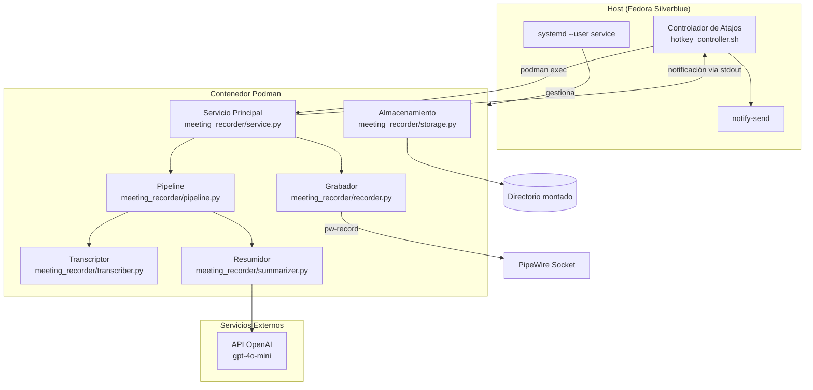
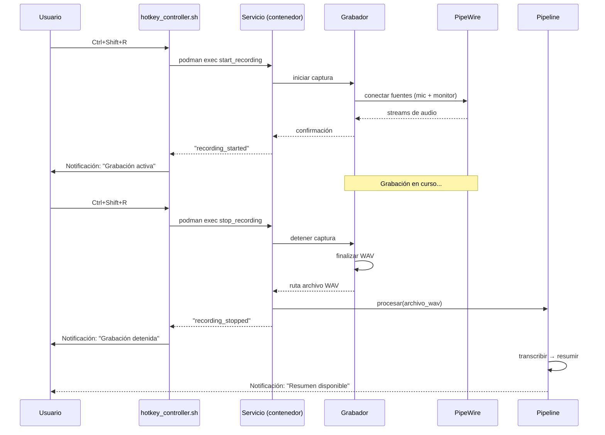

# Documento de Diseño: Meeting Recorder

## Visión General

Meeting Recorder es un servicio de grabación de audio para Fedora Silverblue que se ejecuta dentro de un contenedor Podman. El sistema captura audio del sistema (micrófono + salida de aplicaciones) mediante PipeWire, transcribe con Whisper local y genera resúmenes con la API de OpenAI.

La arquitectura se divide en dos dominios:
- **Host**: Script controlador que intercepta atajos de teclado y se comunica con el contenedor via `podman exec`.
- **Contenedor**: Servicio Python que gestiona la grabación de audio, transcripción y resumen.

El acceso al audio del host se logra montando el socket de PipeWire (`$XDG_RUNTIME_DIR/pipewire-0`) dentro del contenedor, permitiendo que `pw-record` y `pw-cat` capturen fuentes de audio sin acceso directo al hardware.

## Arquitectura

### Diagrama de Componentes



### Diagrama de Secuencia: Flujo de Grabación



## Componentes e Interfaces

### 1. Controlador de Atajos (`hotkey_controller.sh`)

Script bash que se ejecuta en el host. Usa `dbus-monitor` o `xdotool`/`libinput` para interceptar el atajo de teclado.

```python
# Interfaz conceptual del controlador
class HotkeyController:
    """Se ejecuta en el host como script bash."""

    def toggle_recording() -> str:
        """
        Ejecuta 'podman exec meeting-recorder python -m meeting_recorder.cli toggle'
        Returns: "recording_started" | "recording_stopped" | "error:<mensaje>"
        Timeout: 5 segundos
        """
        ...

    def show_notification(title: str, body: str, timeout_ms: int = 3000) -> None:
        """Ejecuta notify-send en el host."""
        ...
```

**Implementación**: Script bash que registra un atajo global via `gsettings` (GNOME) o un servicio `systemd --user` con `evdev`/`libinput`.

### 2. Servicio Principal (`meeting_recorder/service.py`)

Punto de entrada del contenedor. Gestiona el estado de grabación y despacha comandos.

```python
from dataclasses import dataclass
from enum import Enum

class RecordingState(Enum):
    IDLE = "idle"
    RECORDING = "recording"

@dataclass
class ServiceResponse:
    status: str  # "recording_started" | "recording_stopped" | "error"
    message: str

class RecorderService:
    def __init__(self, storage: StorageManager, config: AppConfig) -> None: ...
    def toggle(self) -> ServiceResponse: ...
    def status(self) -> RecordingState: ...
```

### 3. Grabador (`meeting_recorder/recorder.py`)

Captura audio mediante `pw-record` (herramienta CLI de PipeWire disponible dentro del contenedor).

```python
from pathlib import Path
from dataclasses import dataclass

@dataclass
class RecordingResult:
    file_path: Path
    duration_seconds: float
    sources_captured: list[str]  # ["microphone", "monitor"] o subconjunto

class AudioRecorder:
    def __init__(self, storage: StorageManager) -> None: ...

    def start(self) -> None:
        """
        Inicia dos procesos pw-record:
        - Uno para la fuente de micrófono (input)
        - Uno para el monitor del sink (output de aplicaciones)
        Mezcla ambos con ffmpeg en tiempo real o al finalizar.
        Formato: WAV 16kHz, 16-bit, mono.
        Raises: PipeWireConnectionError si no puede conectar.
        """
        ...

    def stop(self) -> RecordingResult:
        """
        Detiene los procesos de captura.
        Mezcla las fuentes en un único archivo WAV.
        Timeout máximo: 3 segundos para finalizar.
        """
        ...

    def is_recording(self) -> bool: ...
```

**Estrategia de captura de audio**:
1. Se lanzan dos subprocesos `pw-record`:
   - `pw-record --target <mic_node_id> mic_temp.wav` — captura micrófono
   - `pw-record --target <monitor_node_id> monitor_temp.wav` — captura salida de apps (monitor del sink por defecto)
2. Al detener, se mezclan con `ffmpeg -i mic.wav -i monitor.wav -filter_complex amix=inputs=2:normalize=1 output.wav`
3. El resultado se convierte a 16kHz mono si es necesario.

Los nodos de PipeWire se descubren con `pw-cli list-objects` filtrando por tipo.

### 4. Transcriptor (`meeting_recorder/transcriber.py`)

```python
from pathlib import Path

@dataclass
class TranscriptionResult:
    text: str
    file_path: Path
    language_detected: str | None

class Transcriber:
    def __init__(self, model_name: str = "base", use_cuda: bool = False) -> None:
        """
        Carga el modelo de Whisper.
        Modelos válidos: tiny, base, small, medium, large, turbo.
        Raises: InvalidModelError si el nombre no es válido.
        """
        ...

    def transcribe(self, audio_path: Path, output_dir: Path) -> TranscriptionResult:
        """
        Transcribe el archivo de audio y guarda el resultado como .txt UTF-8.
        El nombre del archivo mantiene el prefijo temporal de la grabación.
        Raises: TranscriptionError si falla.
        """
        ...
```

### 5. Resumidor (`meeting_recorder/summarizer.py`)

```python
from pathlib import Path

@dataclass
class SummaryResult:
    content: str
    file_path: Path
    bullet_count: int

class Summarizer:
    def __init__(self, api_key: str, model: str = "gpt-4o-mini") -> None:
        """
        Raises: ConfigurationError si api_key está vacía.
        """
        ...

    def summarize(self, transcription_text: str, output_dir: Path, timestamp: str) -> SummaryResult:
        """
        Envía la transcripción a OpenAI y genera resumen en Markdown.
        Prompt: genera 5-15 viñetas con decisiones, tareas y temas.
        Timeout: 60 segundos.
        Raises: SummaryError si la API falla o no responde.
        """
        ...
```

### 6. Pipeline (`meeting_recorder/pipeline.py`)

```python
import asyncio
from pathlib import Path

class ProcessingPipeline:
    MAX_CONCURRENT = 3

    def __init__(self, transcriber: Transcriber, summarizer: Summarizer) -> None: ...

    async def process(self, audio_path: Path) -> None:
        """
        Ejecuta secuencialmente: transcripción → resumen.
        Timeout por paso: 120 segundos.
        Si la transcripción falla, no ejecuta el resumen.
        Envía notificación al completar o fallar.
        """
        ...

    def active_count(self) -> int:
        """Número de pipelines en ejecución."""
        ...
```

### 7. Almacenamiento (`meeting_recorder/storage.py`)

```python
from pathlib import Path
from datetime import datetime

class StorageManager:
    def __init__(self, base_path: Path) -> None:
        """
        Inicializa la estructura de directorios.
        Raises: StorageError si no puede crear o acceder a los directorios.
        """
        ...

    @property
    def recordings_dir(self) -> Path: ...

    @property
    def transcriptions_dir(self) -> Path: ...

    @property
    def summaries_dir(self) -> Path: ...

    def generate_timestamp(self) -> str:
        """Genera timestamp en formato YYYY-MM-DD_HH-MM-SS en zona horaria local."""
        ...

    def check_disk_space(self, min_mb: int = 50) -> bool:
        """Verifica que hay al menos min_mb MB disponibles."""
        ...

    def ensure_directories(self) -> None:
        """Crea recordings/, transcriptions/, summaries/ si no existen."""
        ...
```

### 8. Configuración (`meeting_recorder/config.py`)

```python
from dataclasses import dataclass, field
from pathlib import Path

@dataclass
class AppConfig:
    openai_api_key: str = ""
    whisper_model: str = "base"
    enable_cuda: bool = False
    storage_path: Path = field(default_factory=lambda: Path.home() / "meeting-recorder-data")

    VALID_MODELS: tuple[str, ...] = ("tiny", "base", "small", "medium", "large", "turbo")

    @classmethod
    def from_env(cls) -> "AppConfig":
        """Lee configuración desde variables de entorno."""
        ...

    def validate(self) -> list[str]:
        """Retorna lista de errores de validación. Lista vacía = válido."""
        ...
```

## Modelos de Datos

### Estructura de Directorios del Proyecto

```
meeting-recorder/
├── Containerfile
├── pyproject.toml
├── README.md
├── scripts/
│   ├── hotkey_controller.sh        # Script del host
│   └── install.sh                  # Instalador del servicio systemd
├── systemd/
│   └── meeting-recorder.container  # Quadlet para Podman
├── meeting_recorder/
│   ├── __init__.py
│   ├── __main__.py                 # Entry point: python -m meeting_recorder
│   ├── cli.py                      # Comandos: toggle, status
│   ├── config.py
│   ├── service.py
│   ├── recorder.py
│   ├── transcriber.py
│   ├── summarizer.py
│   ├── pipeline.py
│   ├── storage.py
│   └── exceptions.py
└── tests/
    ├── test_config.py
    ├── test_storage.py
    ├── test_transcriber.py
    ├── test_summarizer.py
    └── test_pipeline.py
```

### Estructura de Almacenamiento en Disco

```
~/meeting-recorder-data/          # $MEETING_RECORDER_DATA_DIR
├── recordings/
│   ├── 2025-01-15_09-30-00.wav
│   └── 2025-01-15_14-00-00.wav
├── transcriptions/
│   ├── 2025-01-15_09-30-00.txt
│   └── 2025-01-15_14-00-00.txt
└── summaries/
    ├── 2025-01-15_09-30-00.md
    └── 2025-01-15_14-00-00.md
```

### Containerfile

```dockerfile
FROM fedora:41

RUN dnf install -y \
    python3.12 \
    pipewire \
    pipewire-utils \
    ffmpeg \
    && dnf clean all

# Instalar uv
COPY --from=ghcr.io/astral-sh/uv:latest /uv /usr/local/bin/uv

WORKDIR /app
COPY pyproject.toml .
RUN uv sync --frozen

COPY meeting_recorder/ meeting_recorder/

ENTRYPOINT ["uv", "run", "python", "-m", "meeting_recorder"]
CMD ["serve"]
```

### Quadlet (systemd) — `meeting-recorder.container`

```ini
[Unit]
Description=Meeting Recorder Service
After=pipewire.service

[Container]
Image=localhost/meeting-recorder:latest
ContainerName=meeting-recorder
Volume=%h/meeting-recorder-data:/data:Z
Volume=%t/pipewire-0:/tmp/pipewire-0
Environment=XDG_RUNTIME_DIR=/tmp
Environment=OPENAI_API_KEY=%E{OPENAI_API_KEY}
Environment=WHISPER_MODEL=base
Environment=ENABLE_CUDA=false
Environment=STORAGE_PATH=/data
Exec=serve

[Service]
Restart=on-failure
RestartSec=5
StartLimitBurst=3
StartLimitIntervalSec=60

[Install]
WantedBy=default.target
```

### Variables de Entorno

| Variable | Descripción | Valor por defecto |
|----------|-------------|-------------------|
| `OPENAI_API_KEY` | Clave API de OpenAI | (requerida) |
| `WHISPER_MODEL` | Modelo de Whisper | `base` |
| `ENABLE_CUDA` | Habilitar GPU NVIDIA | `false` |
| `STORAGE_PATH` | Ruta de almacenamiento | `~/meeting-recorder-data/` |
| `MEETING_RECORDER_DATA_DIR` | Alias de STORAGE_PATH en host | `~/meeting-recorder-data/` |

### Formato de Respuesta del Servicio

```python
# Comunicación entre host y contenedor via stdout de podman exec
# Formato: JSON de una línea

{"status": "recording_started", "message": "Grabación iniciada", "timestamp": "2025-01-15_09-30-00"}
{"status": "recording_stopped", "message": "Grabación detenida", "file": "2025-01-15_09-30-00.wav"}
{"status": "error", "message": "PipeWire no disponible"}
```


## Propiedades de Correctitud

*Una propiedad es una característica o comportamiento que debe mantenerse verdadero en todas las ejecuciones válidas de un sistema — esencialmente, una declaración formal sobre lo que el sistema debe hacer. Las propiedades sirven como puente entre especificaciones legibles por humanos y garantías de correctitud verificables por máquina.*

### Propiedad 1: Formato WAV de salida válido

*Para cualquier* buffer de audio capturado, el archivo WAV resultante SHALL tener frecuencia de muestreo de 16000 Hz, profundidad de 16 bits, 1 canal (mono), y cabeceras RIFF/fmt/data válidas.

**Valida: Requisitos 1.3, 1.7**

### Propiedad 2: Normalización de mezcla de audio

*Para cualquier* par de buffers de audio con amplitudes diferentes, la función de mezcla SHALL producir una salida donde ambas fuentes contribuyen con niveles de señal equivalentes (diferencia máxima de 3 dB entre fuentes).

**Valida: Requisito 1.2**

### Propiedad 3: Consistencia de nombres temporales entre artefactos

*Para cualquier* datetime válido, la función de generación de timestamp SHALL producir una cadena que coincida con el patrón `YYYY-MM-DD_HH-MM-SS`, y los archivos de grabación (.wav), transcripción (.txt) y resumen (.md) generados en la misma sesión SHALL compartir exactamente el mismo prefijo temporal.

**Valida: Requisitos 1.5, 3.5, 4.5, 6.3**

### Propiedad 4: Alternancia de estado de grabación

*Para cualquier* secuencia de N comandos toggle comenzando desde el estado IDLE, el estado resultante SHALL ser RECORDING si N es impar, e IDLE si N es par.

**Valida: Requisito 2.1**

### Propiedad 5: Validación de nombre de modelo

*Para cualquier* cadena de texto, la función de validación de modelo SHALL retornar verdadero únicamente si la cadena es uno de los valores válidos (tiny, base, small, medium, large, turbo), y falso para cualquier otra cadena.

**Valida: Requisitos 3.7, 3.8**

### Propiedad 6: Transcripción produce UTF-8 válido

*Para cualquier* texto de transcripción (incluyendo caracteres Unicode, acentos, emojis), el archivo de salida SHALL ser un archivo de texto plano con codificación UTF-8 válida ubicado en el directorio `transcriptions/`.

**Valida: Requisito 3.4**

### Propiedad 7: Resumen contiene entre 5 y 15 viñetas

*Para cualquier* texto de transcripción no vacío procesado por el resumidor, el resumen generado SHALL contener entre 5 y 15 viñetas (bullet points) en formato Markdown.

**Valida: Requisito 4.3**

### Propiedad 8: Resumen es Markdown válido en directorio correcto

*Para cualquier* resultado de resumen, el archivo de salida SHALL ser un archivo Markdown válido (extensión .md) ubicado en el directorio `summaries/`.

**Valida: Requisito 4.4**

### Propiedad 9: Creación de estructura de directorios

*Para cualquier* ruta base válida y accesible, la función `ensure_directories` SHALL crear exactamente tres subdirectorios: `recordings/`, `transcriptions/`, y `summaries/`, todos con permisos de lectura y escritura para el usuario del proceso.

**Valida: Requisitos 6.1, 6.2**

### Propiedad 10: Ejecución secuencial del pipeline

*Para cualquier* archivo de audio procesado por el pipeline, la transcripción SHALL completarse antes de que se inicie la generación de resumen, y el resumen SHALL recibir como entrada el texto producido por la transcripción.

**Valida: Requisito 7.1**

### Propiedad 11: Límite de pipelines concurrentes

*Para cualquier* número de solicitudes de procesamiento simultáneas, el sistema SHALL permitir un máximo de 3 pipelines ejecutándose concurrentemente, rechazando o encolando solicitudes adicionales.

**Valida: Requisito 7.2**

### Propiedad 12: Ausencia de rutas Windows en código fuente

*Para cualquier* archivo de código fuente en el proyecto, el contenido SHALL no contener letras de unidad Windows (e.g., `C:\`), separadores backslash como delimitadores de ruta, ni referencias a binarios `.exe`.

**Valida: Requisitos 8.2, 8.3**

## Manejo de Errores

### Estrategia General

El sistema usa un patrón de errores jerárquico con excepciones personalizadas:

```python
# meeting_recorder/exceptions.py

class MeetingRecorderError(Exception):
    """Error base del sistema."""
    pass

class PipeWireConnectionError(MeetingRecorderError):
    """No se puede conectar a PipeWire."""
    pass

class RecordingError(MeetingRecorderError):
    """Error durante la grabación."""
    pass

class TranscriptionError(MeetingRecorderError):
    """Error durante la transcripción."""
    pass

class InvalidModelError(TranscriptionError):
    """Modelo de Whisper no válido."""
    pass

class SummaryError(MeetingRecorderError):
    """Error durante la generación de resumen."""
    pass

class ConfigurationError(MeetingRecorderError):
    """Error de configuración (API key faltante, etc.)."""
    pass

class StorageError(MeetingRecorderError):
    """Error de almacenamiento (permisos, espacio, etc.)."""
    pass

class DiskSpaceError(StorageError):
    """Espacio en disco insuficiente."""
    pass

class PipelineTimeoutError(MeetingRecorderError):
    """Un paso del pipeline excedió el timeout."""
    pass
```

### Tabla de Errores por Componente

| Componente | Error | Acción | Requisito |
|------------|-------|--------|-----------|
| Grabador | PipeWire no disponible | Log error + notificación stderr en ≤2s | 1.4 |
| Grabador | Una fuente no disponible | Continuar con fuente disponible + advertencia | 1.6 |
| Grabador | Espacio en disco < 50 MB | Detener grabación ordenadamente + notificar | 1.8 |
| Controlador | Contenedor no responde (5s) | Notificación error + mantener estado | 2.6 |
| Controlador | Contenedor no ejecutándose | Notificación error | 2.7 |
| Transcriptor | Modelo inválido | Log error con valores válidos + no transcribir | 3.8 |
| Transcriptor | Fallo de transcripción | Log error + conservar audio | 3.6 |
| Resumidor | API key vacía/faltante | Error + no procesar | 4.8 |
| Resumidor | API timeout (60s) / error | Log error + conservar transcripción | 4.6 |
| Pipeline | Transcripción falla | Omitir resumen + notificación | 7.3 |
| Pipeline | Paso excede 120s | Cancelar paso + log timeout | 7.5 |
| Almacenamiento | Ruta inaccesible | Error + detener ejecución | 6.5 |
| Almacenamiento | No puede crear directorios | Error + detener ejecución | 6.6 |

### Política de Reintentos

- **Grabación**: Sin reintentos automáticos. El usuario reinicia manualmente.
- **Transcripción**: Sin reintentos automáticos. El audio se conserva para reintento manual.
- **Resumen (API)**: Sin reintentos automáticos. La transcripción se conserva para reintento manual.
- **Contenedor**: Máximo 3 reintentos en 60 segundos (gestionado por systemd).

## Estrategia de Testing

### Enfoque Dual

El proyecto usa dos tipos complementarios de tests:

1. **Tests unitarios (pytest)**: Verifican ejemplos específicos, casos borde y condiciones de error.
2. **Tests basados en propiedades (hypothesis)**: Verifican propiedades universales con entradas generadas aleatoriamente.

### Librería de Property-Based Testing

- **Librería**: [Hypothesis](https://hypothesis.readthedocs.io/) para Python
- **Configuración**: Mínimo 100 iteraciones por test de propiedad
- **Etiquetado**: Cada test referencia su propiedad del documento de diseño

Formato de etiqueta:
```python
# Feature: meeting-recorder, Property 1: Formato WAV de salida válido
```

### Tests Unitarios

| Módulo | Tests | Cobertura |
|--------|-------|-----------|
| `config.py` | Lectura de env vars, valores por defecto, validación | Requisitos 3.7, 3.8, 4.7, 4.8, 5.7 |
| `storage.py` | Creación de directorios, permisos, espacio en disco | Requisitos 6.1-6.6 |
| `recorder.py` | Formato WAV, manejo de fuentes parciales | Requisitos 1.3-1.8 |
| `transcriber.py` | Formato de salida, manejo de errores | Requisitos 3.4-3.8 |
| `summarizer.py` | Formato de viñetas, manejo de errores API | Requisitos 4.3-4.8 |
| `pipeline.py` | Orden de ejecución, concurrencia, timeouts | Requisitos 7.1-7.5 |
| `service.py` | Toggle de estado, respuestas JSON | Requisitos 2.1-2.7 |

### Tests Basados en Propiedades

Cada propiedad del documento de diseño se implementa como un único test con Hypothesis:

```python
from hypothesis import given, settings
from hypothesis import strategies as st

@settings(max_examples=100)
@given(st.binary(min_size=100, max_size=10000))
def test_wav_output_format(audio_data):
    """Feature: meeting-recorder, Property 1: Formato WAV de salida válido"""
    # Verificar que write_wav produce archivo con formato correcto
    ...

@settings(max_examples=100)
@given(st.datetimes())
def test_timestamp_consistency(dt):
    """Feature: meeting-recorder, Property 3: Consistencia de nombres temporales"""
    # Verificar patrón YYYY-MM-DD_HH-MM-SS
    ...

@settings(max_examples=100)
@given(st.integers(min_value=1, max_value=100))
def test_toggle_state_alternation(n_toggles):
    """Feature: meeting-recorder, Property 4: Alternancia de estado de grabación"""
    # Verificar estado final según paridad
    ...

@settings(max_examples=100)
@given(st.text())
def test_model_validation(model_name):
    """Feature: meeting-recorder, Property 5: Validación de nombre de modelo"""
    # Verificar que solo modelos válidos son aceptados
    ...
```

### Tests de Integración

- Comunicación host ↔ contenedor via `podman exec`
- Conexión a PipeWire dentro del contenedor
- Llamada real a API de OpenAI (con mock en CI)
- Build del contenedor y verificación de dependencias

### Ejecución

```bash
# Tests unitarios + propiedades
uv run pytest tests/ -v

# Solo tests de propiedades
uv run pytest tests/ -v -k "property"

# Tests de integración (requiere contenedor corriendo)
uv run pytest tests/integration/ -v
```
